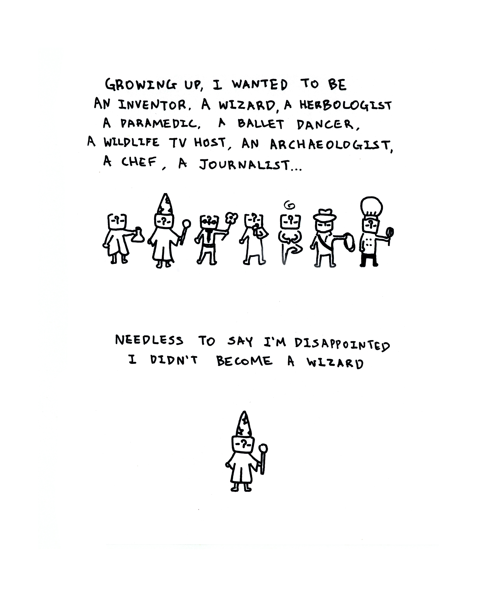
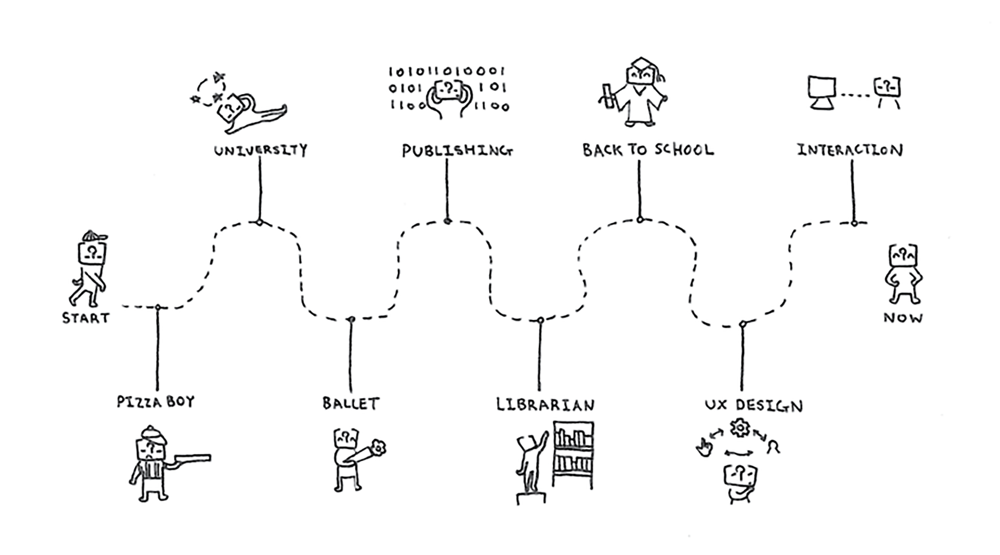

<small>A little comic about me</small>

Figuring out what you want to be is quite taxing.

My path towards becoming an interaction designer was not very straight forward. It was more like a zig-zag cross country ride with many stops, each destination giving me a chance to try new things. For a long time, I felt the paths that I took in my career was embarrassing, because they somehow implied I was directionless, or weak-willed. On the contrary I now view the many different hats I wore in my late teens and early twenties as a badge of honour: They represent someone who is adventurous, and courageous enough to try new things. 

I took many different paths in my career:

<small>My career paths</small>

My customer service jobs throughout my early teens taught me that even in inconspicuous places like a pizza shop, clothing store, tea shop… people notice when you do something nice for them. People notice the guy who pays extra attention to detail when they wrap a gift, or the guy who gives extra dipping sauce. 

In ballet I learned discipline. Probably in a way that no 9-5 jobs could ever teach me. I have never been surrounding by people with that level of drive to be better than when I was on stage.

Publishing was the industry that showed me the direction technology was headed towards, and how design weaves into technology to create a product that can be used by hundreds of thousands of people. 

As a librarian I learned to be comfortable with data. I learned how important communication is, and I made all my first mistakes in office politics and miscommunications there.

UX design showed me the frameworks and methodologies that lead products and services to success. However, at school and in the workplace I was more interested in molding my design to be fair and accessible, rather than making it about growth only.

The ballet dancer in me, the publisher in me, the librarian in me all represent a driven person, a creative person, and someone who is not afraid to take on new challenges. My falls, failures and redirections all ultimately led me to design[^1] as a professional career. 

Thanks to trial and error, I now have a proven track record that shows that when I want something, I go out and get it done. Just like the design process I deploy in my work, I applied same method to my career, ideating and pivoting until my invalidations became validations. I became a designer because the paths that I took led me here. I am grateful for what it took to become a designer too, became I became someone who does not simply stop at representing the users, but someone who cares about bringing fair access to all persons using the product, as much as possible. It is incredibly hard to be a designer in pursuit of fairness. But I am in love with this challenge, because I love to learn, and I certainly like to problem-solve in the way only a designer can. 

[^1]:

  Me landing on interaction, a subfield of UX, was purposeful. UX design describes the process of design from the start-to-end experience of a user. That is a string of touchpoints to design, and sometimes UX can feel indefinite and abstruse, ultimately leading to ambiguity at the end of the project over the ownership of changes that led to success vs failures. By focusing my attention to interaction, I can be hands-on about my inputs and have explicit control over my design choices per touchpoint. Each interaction builds upon the overall experience, and designing interactions allow me to connect the dots. It was exciting: I finally found a way to marry my creativity and my livelihood.

